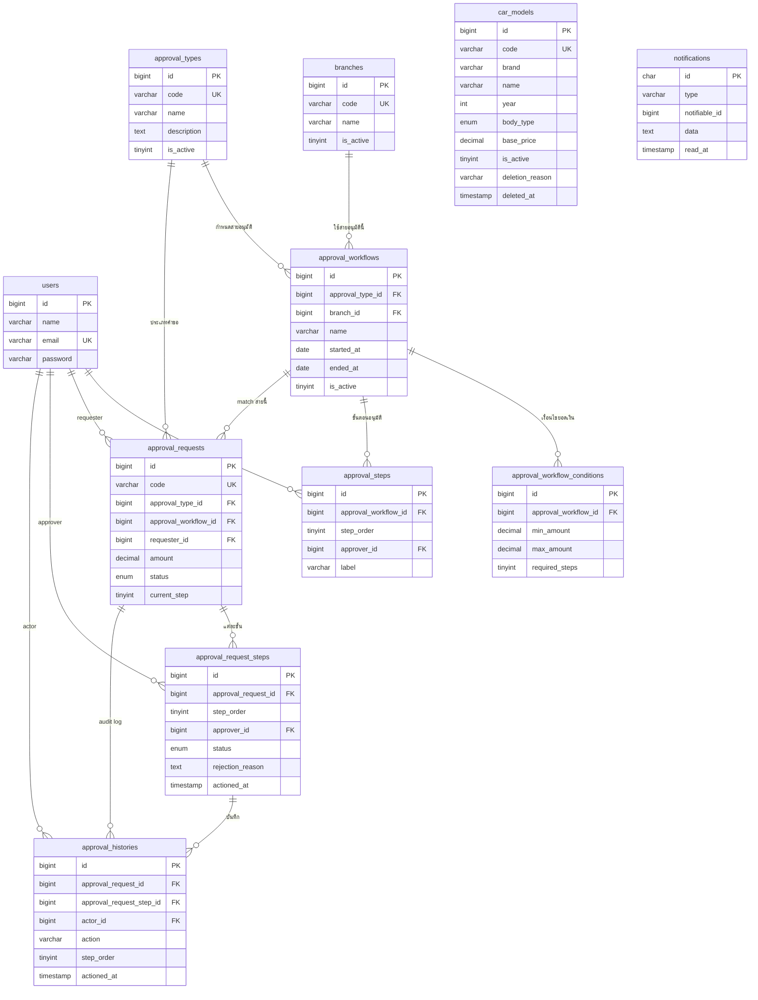

# Toyota Test — Hands-on Project Assessment

## Tech Stack

- Laravel 12 + Filament v4 + Livewire v3 + Tailwind CSS v4
- MariaDB 10.11.16
- Laravel Reverb (WebSocket Broadcast)
- Cloudflare Tunnel

---

## Requirements

- PHP 8.3+
- Composer
- Node.js 20+
- MariaDB 10.11+ หรือ MySQL 8.4+
- Laragon (optional)

---

## Setup

```bash
composer install
npm install
npm run build
cp .env.example .env
php artisan key:generate
php artisan storage:link
```

ตั้งค่า Database ใน `.env`

```env
DB_CONNECTION=mysql
DB_HOST=127.0.0.1
DB_PORT=3306
DB_DATABASE=toyota_test
DB_USERNAME=root
DB_PASSWORD=
```

จากนั้นรัน:

```bash
php artisan migrate --seed
```

> หาก database `toyota_test` ยังไม่มี Laravel จะถามเพื่อสร้างให้อัตโนมัติ
> Seeder จะสร้างบัญชีและข้อมูลตัวอย่างสำหรับทดสอบอัตโนมัติ

---

## Reverb Configuration

เพิ่มค่าใน `.env`

```env
BROADCAST_CONNECTION=reverb

REVERB_APP_ID=your-app-id
REVERB_APP_KEY=your-app-key
REVERB_APP_SECRET=your-app-secret
REVERB_HOST="127.0.0.1"
REVERB_PORT=8080
REVERB_SCHEME=http

VITE_REVERB_APP_KEY="${REVERB_APP_KEY}"
VITE_REVERB_HOST="${REVERB_HOST}"
VITE_REVERB_PORT="${REVERB_PORT}"
VITE_REVERB_SCHEME="${REVERB_SCHEME}"
```

---

## Run Development Server

เปิด 3 terminal แยกกัน:

```bash
# Terminal 1
php artisan serve

# Terminal 2
php artisan reverb:start

# Terminal 3
php artisan queue:work
```

หากใช้ Laragon สามารถเปิดผ่าน:

```text
http://toyota-test.test
```

หรือใช้ Laravel development server:

```text
http://127.0.0.1:8000
```

---

## Cloudflare Tunnel (Remote Access)

สามารถเข้าทดสอบระบบจากภายนอกผ่าน Cloudflare Tunnel ได้

เปิด terminal ใหม่แล้วรัน:

```bash
C:\laragon\bin\cloudflared.exe tunnel --url http://127.0.0.1:8000
```

เมื่อรันสำเร็จ จะได้ URL รูปแบบ:

```text
https://xxxxx.trycloudflare.com
```

ใช้ URL นี้สำหรับเข้าทดสอบระบบจากภายนอกเครื่อง developer

> URL จะเปลี่ยนใหม่ทุกครั้งที่ restart tunnel

---

## เข้าใช้งาน

- Local URL: `http://127.0.0.1:8000/admin`
- Laragon URL: `http://toyota-test.test/admin`
- Cloudflare Tunnel URL: `https://xxxxx.trycloudflare.com/admin`

Seeder จะสร้าง user สำหรับทดสอบดังนี้:

| Name | Email | Password |
|------|-------|----------|
| mikkee | mikkee@test.com | 123456 |
| Admin Toyota | admin@toyota.com | 123456 |
| Manager | manager@toyota.com | 123456 |

---

## Features

- CRUD รุ่นรถยนต์ + Search / Filter / Sort
- Delete with Nested Modal 2 ขั้น + Soft Delete
- Broadcast Notification real-time ผ่าน Laravel Reverb
- บันทึก Notification ลง Database
- Approval Chain Database Design (ER Diagram + Data Dictionary)

---

## Design Decisions

- ใช้ Soft Delete สำหรับ `car_models` เพื่อรองรับ audit และการกู้คืนข้อมูล
- ใช้ `approval_histories` เป็น immutable audit log ห้าม UPDATE และ DELETE
- Approval workflow รองรับ dynamic step ตามช่วงยอดเงิน
- ใช้ Laravel Reverb สำหรับ realtime notification แบบ WebSocket
- ใช้ Filament v4 เพื่อเร่งการพัฒนา admin panel

---

## Known Limitations

- Cloudflare Tunnel URL จะเปลี่ยนใหม่ทุกครั้งที่ restart
- Reverb ใช้งานแบบ local development configuration
- Approval workflow เป็น database design prototype ยังไม่ได้ implement full business flow

---

## Part 1: Database Design — ระบบสายอนุมัติ

### ER Diagram



---

### Data Dictionary

#### 1. `branches` — สาขา

| Column | Type | Null | Default | Description |
|--------|------|------|---------|-------------|
| id | bigint unsigned | NO | AI | Primary Key |
| code | varchar(50) | NO | — | รหัสสาขา (Unique) |
| name | varchar(100) | NO | — | ชื่อสาขา |
| is_active | tinyint(1) | NO | 1 | สถานะ (1=ใช้งาน, 0=ปิด) |
| created_at | timestamp | YES | NULL | วันที่สร้าง |
| updated_at | timestamp | YES | NULL | วันที่แก้ไขล่าสุด |

#### 2. `approval_types` — ประเภทการอนุมัติ

| Column | Type | Null | Default | Description |
|--------|------|------|---------|-------------|
| id | bigint unsigned | NO | AI | Primary Key |
| code | varchar(50) | NO | — | รหัสประเภท (Unique) เช่น QUOTATION, BOOKING |
| name | varchar(100) | NO | — | ชื่อประเภทอนุมัติ เช่น อนุมัติใบเสนอราคา |
| description | text | YES | NULL | คำอธิบายเพิ่มเติม |
| is_active | tinyint(1) | NO | 1 | สถานะ (1=ใช้งาน, 0=ปิด) |
| created_at | timestamp | YES | NULL | วันที่สร้าง |
| updated_at | timestamp | YES | NULL | วันที่แก้ไขล่าสุด |

#### 3. `approval_workflows` — สายอนุมัติ (R1.1)

| Column | Type | Null | Default | Description |
|--------|------|------|---------|-------------|
| id | bigint unsigned | NO | AI | Primary Key |
| approval_type_id | bigint unsigned | NO | — | FK → approval_types.id |
| branch_id | bigint unsigned | YES | NULL | FK → branches.id (สาขาที่ใช้งาน) |
| name | varchar(100) | NO | — | ชื่อสายอนุมัติ |
| started_at | date | NO | — | วันเริ่มต้นใช้งาน |
| ended_at | date | YES | NULL | วันสิ้นสุด (NULL = ไม่มีกำหนด) |
| is_active | tinyint(1) | NO | 1 | สถานะ (1=ใช้งาน, 0=ปิด) |
| created_at | timestamp | YES | NULL | วันที่สร้าง |
| updated_at | timestamp | YES | NULL | วันที่แก้ไขล่าสุด |

#### 4. `approval_workflow_conditions` — เงื่อนไขตามยอดเงิน (R1.1)

| Column | Type | Null | Default | Description |
|--------|------|------|---------|-------------|
| id | bigint unsigned | NO | AI | Primary Key |
| approval_workflow_id | bigint unsigned | NO | — | FK → approval_workflows.id |
| min_amount | decimal(15,2) | NO | 0.00 | ยอดเงินขั้นต่ำของช่วงนี้ |
| max_amount | decimal(15,2) | YES | NULL | ยอดเงินสูงสุด (NULL = ไม่จำกัด) |
| required_steps | tinyint unsigned | NO | — | จำนวนขั้นตอนที่ต้องผ่าน |
| created_at | timestamp | YES | NULL | วันที่สร้าง |
| updated_at | timestamp | YES | NULL | วันที่แก้ไขล่าสุด |

> ตัวอย่าง: 0–3,000 → 2 ขั้น / 3,000–5,000 → 3 ขั้น / มากกว่า 5,000 → 4 ขั้น

#### 5. `approval_steps` — ขั้นตอนอนุมัติ (R1.2)

| Column | Type | Null | Default | Description |
|--------|------|------|---------|-------------|
| id | bigint unsigned | NO | AI | Primary Key |
| approval_workflow_id | bigint unsigned | NO | — | FK → approval_workflows.id |
| step_order | tinyint unsigned | NO | — | ลำดับขั้น (Sequential เท่านั้น ไม่ข้ามขั้น) |
| approver_id | bigint unsigned | NO | — | FK → users.id (ผู้อนุมัติ 1 คนต่อขั้น) |
| label | varchar(100) | YES | NULL | ชื่อขั้นตอน เช่น ผู้จัดการสาขา |
| created_at | timestamp | YES | NULL | วันที่สร้าง |
| updated_at | timestamp | YES | NULL | วันที่แก้ไขล่าสุด |

#### 6. `approval_requests` — คำขออนุมัติ (R1.3)

| Column | Type | Null | Default | Description |
|--------|------|------|---------|-------------|
| id | bigint unsigned | NO | AI | Primary Key |
| code | varchar(50) | NO | — | รหัสคำขอ (Unique ทั้งระบบ) |
| approval_type_id | bigint unsigned | NO | — | FK → approval_types.id |
| approval_workflow_id | bigint unsigned | NO | — | FK → approval_workflows.id |
| requester_id | bigint unsigned | NO | — | FK → users.id (ผู้ยื่นคำขอ) |
| amount | decimal(15,2) | YES | NULL | ยอดเงินของคำขอ |
| status | enum | NO | pending | pending / approved / rejected / cancelled |
| current_step | tinyint unsigned | NO | 1 | ขั้นตอนปัจจุบันที่รออนุมัติ |
| submitted_at | timestamp | YES | NULL | เวลายื่นคำขอ |
| completed_at | timestamp | YES | NULL | เวลาที่เสร็จสิ้น |
| created_at | timestamp | YES | NULL | วันที่สร้าง |
| updated_at | timestamp | YES | NULL | วันที่แก้ไขล่าสุด |

#### 7. `approval_request_steps` — ขั้นตอนของคำขอ (R1.4)

| Column | Type | Null | Default | Description |
|--------|------|------|---------|-------------|
| id | bigint unsigned | NO | AI | Primary Key |
| approval_request_id | bigint unsigned | NO | — | FK → approval_requests.id |
| step_order | tinyint unsigned | NO | — | ลำดับขั้น (ไม่ข้ามขั้น) |
| approver_id | bigint unsigned | NO | — | FK → users.id |
| status | enum | NO | pending | pending / approved / rejected |
| rejection_reason | text | YES | NULL | เหตุผลปฏิเสธ (กรณี rejected) |
| actioned_at | timestamp | YES | NULL | เวลาที่ดำเนินการ |
| created_at | timestamp | YES | NULL | วันที่สร้าง |
| updated_at | timestamp | YES | NULL | วันที่แก้ไขล่าสุด |

#### 8. `approval_histories` — ประวัติการอนุมัติ / Audit Log (R1.5)

> ⚠️ **Immutable** — ห้าม UPDATE และ DELETE ทุกกรณี ไม่มี `updated_at`

| Column | Type | Null | Default | Description |
|--------|------|------|---------|-------------|
| id | bigint unsigned | NO | AI | Primary Key |
| approval_request_id | bigint unsigned | NO | — | FK → approval_requests.id |
| approval_request_step_id | bigint unsigned | YES | NULL | FK → approval_request_steps.id |
| actor_id | bigint unsigned | NO | — | FK → users.id (ผู้ดำเนินการ) |
| action | varchar(50) | NO | — | submitted / approved / rejected |
| step_order | tinyint unsigned | YES | NULL | ขั้นตอนที่เกิด action |
| rejection_reason | text | YES | NULL | เหตุผลปฏิเสธ (ถ้ามี) |
| note | text | YES | NULL | หมายเหตุ |
| actioned_at | timestamp | NO | CURRENT_TIMESTAMP | เวลาที่เกิด action |
| created_at | timestamp | NO | CURRENT_TIMESTAMP | วันที่สร้าง record |

#### 9. `car_models` — รุ่นรถยนต์ (R2.2)

| Column | Type | Null | Default | Description |
|--------|------|------|---------|-------------|
| id | bigint unsigned | NO | AI | Primary Key |
| code | varchar(255) | NO | — | รหัสรุ่น (Unique) รูปแบบ CM-XXXX |
| brand | varchar(255) | NO | — | แบรนด์รถ เช่น Toyota, Honda |
| name | varchar(255) | NO | — | ชื่อรุ่น เช่น Camry, Civic |
| year | int | NO | — | ปี ค.ศ. |
| body_type | enum | NO | — | Sedan / SUV / Pickup / Hatchback / Van |
| base_price | decimal(12,2) | NO | — | ราคาตั้งต้น (ต้องมากกว่า 0) |
| is_active | tinyint(1) | NO | 1 | สถานะ (1=ใช้งาน, 0=ปิด) |
| deletion_reason | varchar(255) | YES | NULL | เหตุผลการลบ (R2.3) |
| deletion_detail | varchar(255) | YES | NULL | รายละเอียดเพิ่มเติมการลบ (R2.3) |
| deleted_at | timestamp | YES | NULL | Soft Delete timestamp |
| created_at | timestamp | YES | NULL | วันที่สร้าง |
| updated_at | timestamp | YES | NULL | วันที่แก้ไขล่าสุด |

#### 10. `notifications` — การแจ้งเตือน (R2.4)

| Column | Type | Null | Default | Description |
|--------|------|------|---------|-------------|
| id | char(36) | NO | — | UUID Primary Key |
| type | varchar(255) | NO | — | Class ของ Notification |
| notifiable_type | varchar(255) | NO | — | Polymorphic type (App\Models\User) |
| notifiable_id | bigint unsigned | NO | — | FK → users.id |
| data | text | NO | — | JSON ข้อมูล notification |
| read_at | timestamp | YES | NULL | เวลาที่อ่าน (NULL = ยังไม่อ่าน) |
| created_at | timestamp | YES | NULL | วันที่สร้าง |
| updated_at | timestamp | YES | NULL | วันที่แก้ไขล่าสุด |